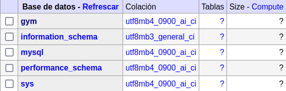
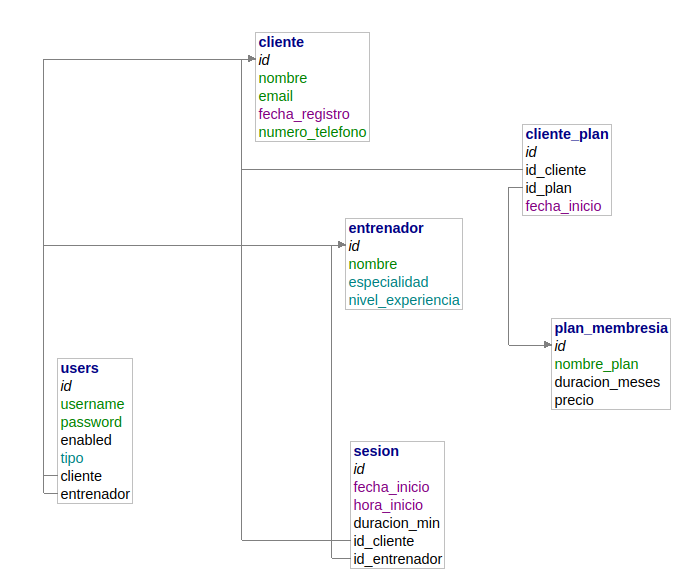

# Gimnasio_Grupo4

|       Alumnos       | Ángela Romero Lobo | Santiago Fuentes Espinosa |
| :------------------: | :-----------------: | :-----------------------: |
|   **Fecha**   | Inicio: 07-11-2024 |      Fin: 21-11-2024      |
| **Asignatura** |   Acceso a datos   |      Acceso a datos      |
|   **Curso**   |       2º DAM       |          2º DAM          |

# Explicación del proyecto

Queremos organizar la información de un gimnasio con las siguientes tablas:

1. **Cliente -->** El cliente tendra un **id** **único** y se almacenará su **nombre**, el **correo**, **fecha de registro** y **número de teléfono.** Cada cliente puede tener una o más **Planes de Membresía** por ende un cliente puede suscribirse a múltiples planes a lo largo del tiempo. Por último, cada cliente puede reservar varias **Sesiones**.
2. **Entrenador -->** El entrenador tendra un **id único** y se almacenará su **nombre**, una **especialidad** (como pesas, cardio, yoga, etc ) y el **nivel de experiencia**.
3. **Plan de Membresía -->** El plan de membresía tendrá un **id único** y se almacenará su **nombre del plan** (por ejemplo "Mensual Básico", "Anual Premiun"), una **duración en meses** y el **costo**.
4. **Sesion -->** Cada sesion tiene un **id único** y se alamacenara **fecha** y **hora de inicio**, y una **duración en minutos**. Cada sesión es atendida por **un solo entrenador** y **un solo cliente.**

# Configuración npm y creación package.json

Para instalar las dependencias del package.json, tenemos que introducir el siguente comando:

```bash
npm install express express-session mysql2 pug body-parser dotenv
```

Para la funcionalidad del login necesitamos instalar **bcrypt**, y para ello necesitamos introducir el siguente comando por la terminal:

```bash
npm install --save bcrypt
```

¿Qué es cada cosa?

* **express** : servidor Web para nodeJS.
* **express-session** : gestiona sesiones (HTTP) entre el servidor Web/cliente web.
* **mysql2** : driver para conectar a mysql.
* **pug** : motor HTML.
* **body-parser** : para convertir los datos de un formulario (verbos GET y POST) en JSON.
* **dotenv** : para cargar archivos de configuración de entorno.

Para ejecutar el servicio lo hacemos mediante el comando:

```bash
node app.js
```

# ¿Cómo se ha generado la base de datos?

#### Archivo .env

Para crear el docker hemos visto necesario crear el .env, el cual va a contener toda la información necesaria para el funcionamiento del docker.

En nuestro caso hemos elegido que tenga estos atributos:

```properties
MYSQL_ROOT_PASSWORD=jkb8kvhgcvhj7
MYSQL_USERNAME=root
MYSQL_PORT=33308
MYSQL_HOST=localhost
MYSQL_DATABASE=gym
ADMINER_PORT=8184
SERVICE_PORT=8000
```

#### Docker-compose.

Para generar el docker compose nos hemos ido a la pagina de **docker-hub ([docker_hub_adminer](https://hub.docker.com/_/adminer/))**  y hemos utilizado el servidor de **admine.** El docker sirve para crear un servidor local en el cual, en este caso se almacena la base de datos:



El archivo el cual hace que se realice el servidor sería **docker-compose.yml**, el cual lo conformará el siguiente codigo:

```bash
version: '3.1'

services:

  adminer:
    image: adminer
    restart: "no"
    ports:
      - ${ADMINER_PORT}:8080

  db-gym:
    image: mysql:latest
    restart: "no"
    environment:
      MYSQL_ROOT_PASSWORD: ${MYSQL_ROOT_PASSWORD}
    ports:
      - ${MYSQL_PORT}:3306
    volumes:
      - ./scripts:/docker-entrypoint-initdb.d

```

Para lanzar el servidor es necesario ejecutar el siguiente comando, estando en la carpeta correspondiente:

```bash
docker-compose up -d
```

#### Carpeta script.

En ella se va a encontrar un archivo **sql**, que en nuestro caso se llama **db.sql,** el cual contiene la base de datos necesaria para realizar el proyecto.

Las tablas necesarias serían las siguientes:

* La primera que hemos creado sería la tabla **cliente**, la cual va a tener los siguientes atributos:
  * **Id cliente :** Es un **número entero**, que se **autoincrementa** por defecto y es la **clave primaria**.
  * **nombre :** Es una **cadena** de caracteres y no puede estar vacia por lo que se le pone **not null.**
  * **email :** Es una **cadena** de caracteres y no puede estar vacia por lo que se le pone **not null.**
  * **fecha de registro :** Es de tipo fecha (**date**) y no puede ser nulo
  * **numero de teléfono :** Es un **numero entero** y no puede estar vacia por lo que se le pone **not null.**

```sql
CREATE TABLE `cliente` (
    `id` int NOT NULL AUTO_INCREMENT PRIMARY KEY,
    `nombre` varchar(150) NOT NULL,
    `email` varchar(150) NOT NULL,
    `fecha_registro` date NOT NULL,
    `numero_telefono` varchar(15) NOT NULL
)
```

* La segunda que hemos creado sería la tabla **entrenador**, la cual va a tener los siguientes atributos:
  * **Id entrenador :** Es un **número entero**, que se **autoincrementa** por defecto y es la **clave primaria**.
  * **nombre :** Es una **cadena** de caracteres y no puede estar vacia por lo que se le pone **not null.**
  * **especialidad :** Es de tipo **enum** el cual va a contener las siguientes opciones:
    * **pesas**
    * **cardio**
    * **yoga**
    * **spinning**
    * **crossfit**
  * **nivel de experiencia:** Es de tipo **enum** el cual va a contener las siguientes opciones:
    * **experto**
    * **avanzado**
    * **intermedio**
    * **principiante**

```sql
CREATE TABLE `entrenador` (
    `id` int NOT NULL AUTO_INCREMENT PRIMARY KEY,
    `nombre` varchar(150) NOT NULL,
    `especialidad` ENUM('pesas', 'cardio', 'yoga', 'spinning', 'crossfit') NOT NULL,
    `nivel_experiencia` ENUM('experto', 'avanzado', 'intermedio', 'principiante') NOT NULL
);
```

* La tercera que hemos creado sería la tabla **plan de membresia**, la cual va a tener los siguientes atributos:

  * **Id plan** **:** Es un **número entero**, que se **autoincrementa** por defecto y es la **clave primaria**.
  * **nombre plan :** Es una **cadena** de caracteres y no puede estar vacia por lo que se le pone **not null.**
  * **duracion de meses :** Es un **numero entero** y no puede estar vacia por lo que se le pone **not null.**
  * **precio** **:** Es un **float** y no puede estar vacia por lo que se le pone **not null.**
    ```sql
    CREATE TABLE `plan_membresia` (
        `id` int NOT NULL AUTO_INCREMENT PRIMARY KEY,
        `nombre_plan` varchar(150) NOT NULL,
        `duracion_meses` int NOT NULL,
        `precio` float NOT NULL
    );
    ```
* La cuarta que hemos creado sería la tabla **sesion**, la cual va a tener los siguientes atributos:

  * **Id sesion** **:** Es un **número entero**, que se **autoincrementa** por defecto y es la **clave primaria**.
  * **fecha de incio :** Es de tipo fecha (**date**) y no puede estar vacia por lo que se le pone **not null.**
  * **hora de inicio :** Es de tipo tiempo (**time**) y no puede estar vacia por lo que se le pone **not null.**
  * **duracion en minutos :** Es un **número entero** y no puede estar vacia por lo que se le pone **not null.**
  * **id de cliente de la sesion :** Es un **número entero** y no puede estar vacia por lo que se le pone **not null.**
  * **id de entrenador de la sesion :** Es un **número entero** y no puede estar vacia por lo que se le pone **not null.**
  * Claves foraneas:
    * El **id de cliente de la sesion** hace referencia al id de la tabla cliente.
    * El **id de entrenador de la sesion** hace referencia al id de la tabla entrenador.

```sql
CREATE TABLE `sesion` (
    `id` int NOT NULL AUTO_INCREMENT PRIMARY KEY,
    `fecha_inicio` date NOT NULL,
    `hora_inicio` time NOT NULL,
    `duracion_min` int NOT NULL,
    `id_cliente` INT NOT NULL,
    `id_entrenador` INT NOT NULL,
    FOREIGN KEY (`id_cliente`) REFERENCES `cliente`(`id`),
    FOREIGN KEY (`id_entrenador`) REFERENCES `entrenador`(`id`)
);
```

* Y por último hemos creado la tabla **cliente plan**, la cual va a tener los siguientes atributos:
  * **Id cliente-plan** **:** Es un **número entero**, que se **autoincrementa** por defecto y es la **clave primaria**.
  * **cliente** : Es un **número entero**, no puede estar vacia por lo que se le pone **not null, y es la **clave primaria**.**
  * **plan** : Es un **número entero**, no puede estar vacia por lo que se le pone **not null, y es la **clave primaria**.**
  * **fecha de inicio** : Es de tipo fecha (**date**) y no puede estar vacia por lo que se le pone **not null.**
  * Claves foraneas:
    * El **cliente** hace referencia al id de la tabla cliente.
    * El **plan** hace referencia al id de la tabla plan.

```sql
CREATE TABLE `cliente_plan` (
    `id` INT NOT NULL AUTO_INCREMENT PRIMARY KEY,
    `id_cliente` INT NOT NULL,
    `id_plan` INT NOT NULL,
    `fecha_inicio` DATE NOT NULL, 
    FOREIGN KEY (`id_cliente`) REFERENCES `cliente`(`id`),
    FOREIGN KEY (`id_plan`) REFERENCES `plan_membresia`(`id`)
);
```

* Para el funcionamiento del login hemos creado la tabla **users,** la cual va a tener los siguentes atributos:

  * **Id user:** Es un **número entero**, que se **autoincrementa** por defecto y es la **clave primaria**.
  * **username:** Es una **cadena** de caracteres, y no puede estar vacia por lo que se le pone **not null.**
  * **password:** Es una **cadena** de caracteres, y no puede estar vacia por lo que se le pone **not null.**
  * enabled: bool.
  * **tipo:** Es de tipo **enum** el cual va a contener las siguientes opciones:

    * **Entrenador**
    * **Cliente**
    * **Admin**

  ```sql
  CREATE TABLE IF NOT EXISTS users (
      id INT AUTO_INCREMENT PRIMARY KEY,
      username VARCHAR(255) NOT NULL,
      `password` VARCHAR(255) NOT NULL, 
      `enabled` BOOL,
      tipo ENUM('ENTRENADOR', 'CLIENTE', 'ADMIN'),  
      cliente INT REFERENCES cliente(id),
      entrenador INT REFERENCES entrenador(id)
  );
  ```

#### Esquema de la base de datos.

El esquema de la base de datos es el siguiente:



# Crud realizados para la funcionalidad de la aplicación.

#### Crud de Clientes

| VERBO | RUTA                 | ACCIÓN                                                  |
| ----- | -------------------- | -------------------------------------------------------- |
| GET   | /clientes            | Listar todos los clientes                                |
| GET   | /clientes/add        | Muestra el formulario para añadir un cliente            |
| POST  | /clientes/add        | Añade un cliente a la base de datos                     |
| GET   | /clientes/edit/:id   | Muestra el formulario para editar el cliente con ese ID  |
| POST  | /clientes/edit/:id   | Guarda la información del cliente con ese ID           |
| GET   | /clientes/delete/:id | Muestra el formulario para borrar el cliente con ese ID |
| POST  | /clientes/delete/:id | Borra el cliente con ese ID                              |

#### Crud de Entrenador

| VERBO | RUTA                     | ACCIÓN                                                     |
| ----- | ------------------------ | ----------------------------------------------------------- |
| GET   | /entrenadores            | Listar todos los entrenadores                               |
| GET   | /entrenadores/add        | Muestra el formulario para añadir un entrenador            |
| POST  | /entrenadores/add        | Añade un entrenador a la base de datos                     |
| GET   | /entrenadores/edit/:id   | Muestra el formulario para editar el entrenador con ese ID  |
| POST  | /entrenadores/edit/:id   | Guarda la información del entrenador con ese ID           |
| GET   | /entrenadores/delete/:id | Muestra el formulario para borrar el entrenador con ese ID |
| POST  | /entrenadores/delete/:id | Borra el entrenador con ese ID                              |

#### Crud de Plan de Membresía

| VERBO | RUTA                       | ACCIÓN                                                              |
| ----- | -------------------------- | -------------------------------------------------------------------- |
| GET   | /planMembresias            | Listar todos los planes de membresía                                |
| GET   | /planMembresias/add        | Muestra el formulario para añadir un plan de membresía             |
| POST  | /planMembresias/add        | Añade un plan de membresía a la base de datos                     |
| GET   | /planMembresias/edit/:id   | Muestra el formulario para editar el plan de membresía con ese ID  |
| POST  | /planMembresias/edit/:id   | Guarda la información del plan de membresía con ese ID            |
| GET   | /planMembresias/delete/:id | Muestra el formulario para borrar el plan de membresía con ese ID |
| POST  | /planMembresias/delete/:id | Borra el plan de membresía con ese ID                              |

#### Crud de Sesión

| VERBO | RUTA                 | ACCIÓN                                                   |
| ----- | -------------------- | --------------------------------------------------------- |
| GET   | /sesiones            | Listar todas las sesiones                                 |
| GET   | /sesiones/add        | Muestra el formulario para añadir una sesión            |
| POST  | /sesiones/add        | Añade una sesión a la base de datos                    |
| GET   | /sesiones/edit/:id   | Muestra el formulario para editar la sesión con ese ID |
| POST  | /sesiones/edit/:id   | Guarda la información de la sesión con ese ID          |
| GET   | /sesiones/delete/:id | Muestra el formulario para borrar la sesión con ese ID  |
| POST  | /sesiones/delete/:id | Borra la sesión con ese ID                             |

#### Planes de Membresías por Cliente

| VERBO | RUTA                        | ACCIÓN                                                                         |
| ----- | --------------------------- | ------------------------------------------------------------------------------- |
| GET   | /clientes/:id/planes        | Listar todos los planes de membresía del cliente                               |
| GET   | /clientes/:id/planes/add    | Muestra el formulario para añadir un plan de membresía a un cliente           |
| POST  | /clientes/:id/planes/add    | Añade un plan de membresía a un cliente a la base de datos                   |
| GET   | /clientes/:id/planes/delete | Muestra el formulario para borrar un plan de mebresía a un cliente con ese ID |
| POST  | /clientes/:id/planes/delete | Borra la información del plan de membresía al cliente con ese ID             |

#### Sesiones por Entrenador

| VERBO | RUTA                                                  | ACCIÓN                                                                  |
| ----- | ----------------------------------------------------- | ------------------------------------------------------------------------ |
| GET   | /entrenadores/:id/sesiones                            | Listar todas las sesiones del entrenador                                 |
| GET   | /entrenadores/:id/sesiones/add                        | Muestra el formulario para añadir una sesión a un entrenador           |
| POST  | /entrenadores/:id/sesiones/add                        | Añade una sesión a un entrenador a la base de datos                   |
| GET   | /entrenadores/:idEntrenador/sesiones/delete/:idSesion | Muestra el formulario para borrar la sesión a un entrenador con ese ID |
| POST  | /entrenadores/:idEntrenador/sesiones/delete/:idSesion | Borrar la información de la sesión al entrenador con ese ID           |
